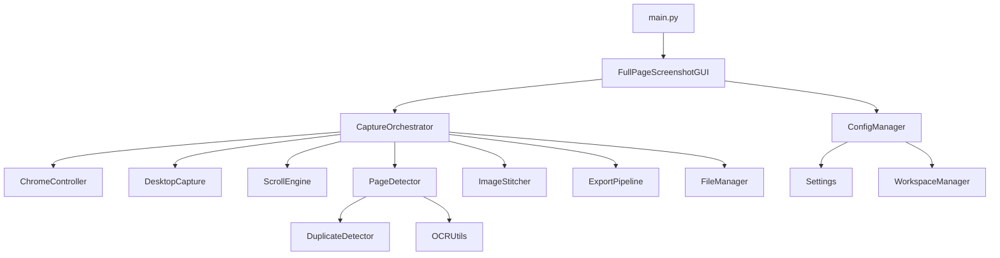

# Full-Page-Screenshot

A desktop automation tool that captures full-page screenshots of every open Google Chrome tab and exports them as PDF, PNG, or JPEG — without using browser extensions, cloud services, or third-party accounts.

---

## The Problem

Capturing a complete webpage screenshot sounds trivial until you actually try it.

Browser extensions exist, but most have one or more of these problems:
- They truncate at a fixed pixel height
- They miss elements that load on scroll (lazy-loaded images, deferred iframes)
- They require a browser account or cloud upload to export as PDF
- They add watermarks on free tiers
- They do not work reliably on pages with sticky headers or fixed navigation bars
- They capture only the viewport, not the full rendered page
- They cannot batch-process multiple tabs in sequence

Built-in browser print-to-PDF exists, but:
- It reformats the layout for print (breaks column grids, cuts off overflow)
- It cannot reproduce what the page actually looks like in the browser
- It does not preserve the pixel-accurate visual representation

This tool captures what the screen actually looks like at every scroll position, stitches all frames into a single continuous image, and exports it in your chosen format. No reformatting. No layout changes. No accounts.

---

## What It Does

Full-Page-Screenshot automates the following sequence for each Chrome tab:

1. Activates the Chrome window and scrolls to the top of the page
2. Takes a full-desktop screenshot at each scroll position (captures the entire screen, including the Windows taskbar and system clock — useful for timestamped audit captures)
3. Detects the bottom of the page using Windows UI Automation scroll position (not image hashing or timeouts)
4. Stitches all frames into a single tall image with configurable overlap to prevent seam artifacts
5. Exports the result as PDF, PNG, or JPEG
6. Moves to the next tab and repeats

After all tabs are processed, the session metadata (timestamps, tab count, export format, elapsed time) is saved alongside the output files.

---

## Features

- Captures all open Chrome tabs in sequence, unattended
- Uses Windows UI Automation (UIA) to detect true end-of-page — no pixel limit, no timeout cutoff, no false stops
- Full-desktop capture includes the taskbar, clock, and system chrome at every frame
- Configurable scroll speed, scroll delay, and frame overlap
- Exports to PDF (single-page auto-height or paginated A4/Letter), PNG, or JPEG
- PDF pagination: long pages are automatically sliced into standard multi-page documents at the configured DPI
- Duplicate frame detection as a secondary stop signal (image hashing)
- OCR-based text extraction from frames (Tesseract) as a tertiary stop signal
- Session logs saved per-run with timestamps and per-frame events
- Persistent settings saved as JSON, restored on next launch
- First-run workspace wizard for setting the output directory
- Dark/light theme toggle
- Live progress tracking with per-tab status and ETA
- Buildable as a standalone Windows `.exe` via PyInstaller — no Python installation required on the target machine

---

## Architecture

The application is split into focused single-responsibility modules.

```text
Full-Page-Screenshot/
├── main.py                  # Entry point
├── gui.py                   # CustomTkinter desktop GUI and capture orchestration
├── chrome_controller.py     # Chrome window detection, activation, tab switching
├── desktop_capture.py       # Full-screen frame capture via mss
├── scroll_engine.py         # Page scroll logic with UIA-based end detection
├── image_stitcher.py        # Vertical image stitching with overlap
├── duplicate_detector.py    # Perceptual image hashing for duplicate frame detection
├── page_detector.py         # Combines duplicate detection and OCR for stop signals
├── ocr_utils.py             # Tesseract OCR text extraction
├── export_pipeline.py       # PDF, PNG, and JPEG export with pagination
├── file_manager.py          # Output file naming, session directory management
├── workspace_manager.py     # First-run wizard and workspace folder setup
├── config.py                # Configuration loading and persistence
├── settings.py              # Settings dataclass
├── constants.py             # Application-wide constants
├── logger.py                # Rotating file and console logging
├── exceptions.py            # Custom exception hierarchy
├── progress.py              # Per-tab progress tracking and ETA
├── system_metrics.py        # System resource monitoring
├── update_checker.py        # Update check framework (not yet active)
├── utils.py                 # Shared utility functions
├── requirements.txt         # Python dependencies
├── build.bat                # PyInstaller build script
├── release.bat              # Packages exe + docs into a Release/ folder
├── Full-Page-Screenshot.spec    # PyInstaller spec (controls exe name, assets, flags)
├── Output/                  # Default output directory for captures
├── Logs/                    # Timestamped execution logs
├── Temp/                    # Temporary working files (cleared between sessions)
├── Tests/                   # Pytest unit test suite
└── assets/                  # Application icons
```

### Module Dependency Graph



### End-of-Page Detection

Scrolling stops only when the Windows UI Automation vertical scroll percentage for the Chrome window reaches ≥ 99.9%, confirmed by one additional scroll attempt that produces the same result. Image hashing and OCR are secondary signals — they do not override the UIA check. There is no hard scroll limit, page height limit, screenshot count limit, or timeout that forces the capture to stop early.

---

## Requirements

- Windows 10 or 11
- Python 3.10 or later
- Google Chrome (not Chromium or Edge)
- Tesseract-OCR installed and added to `PATH` ([UB Mannheim build for Windows](https://github.com/UB-Mannheim/tesseract/wiki))

---

## Installation

```bash
git clone https://github.com/VipranshOjha/Daily-Problem-Solvers.git
cd Daily-Problem-Solvers/Full-Page-Screenshot
python -m venv .venv
.venv\Scripts\activate
pip install -r requirements.txt
```

---

## Usage

1. Open Google Chrome. Load all tabs you want to capture. Do not minimize the window.
2. Run the application:

```bash
python main.py
```

3. On first launch, the workspace setup wizard runs. Choose where output files, logs, and settings will be stored.

4. In the GUI:
   - Enter the number of open tabs.
   - Optionally change the output directory.
   - Click **Start**.

5. Do not move the mouse or use the keyboard while the capture is running. The automation drives the mouse and keyboard.

The application processes each tab sequentially. When finished, all output files are in the configured workspace directory under `Output/`.

---

## Configuration

Settings are saved as `settings.json` in the workspace directory and restored on the next launch. All options are configurable from the Settings dialog in the GUI.

| Setting | Default | Description |
|---|---|---|
| `scroll_speed` | `0.5s` | Delay between scroll events |
| `scroll_delay` | `1.0s` | Wait time after each scroll for page rendering |
| `overlap` | `200px` | Pixel overlap between consecutive frames to prevent seam artifacts |
| `capture_mode` | `1` (UIA end-of-page) | Stop condition: 1=UIA, 2=time limit, 3=screenshot count, 5=manual |
| `export_format` | `PDF` | Output format: PDF, PNG, JPEG |
| `pdf_page_size` | `Auto Height` | PDF page size: A4, Letter, Auto Height |
| `pdf_orientation` | `Automatic` | PDF orientation: Portrait, Landscape, Automatic |
| `pdf_dpi` | `150` | DPI for PDF rendering (higher = larger file, sharper output) |

---

## Building the Executable

Produces a standalone `.exe` that runs without a Python installation.

```bash
.venv\Scripts\activate
build.bat
```

The executable is placed in `dist/Full-Page-Screenshot.exe`.

To create a bundled release package:

```bash
release.bat
```

This runs the build and copies the `.exe`, `README.md`, and `LICENSE` into a `Release/` directory.

---

## Limitations

- **Windows only.** The scroll detection relies on Windows UI Automation. macOS and Linux are not supported.
- **Google Chrome only.** The window detection matches on the window title `"Google Chrome"`. Other Chromium-based browsers (Edge, Brave) are not currently supported.
- **Mouse and keyboard must be idle during capture.** The automation drives input directly. Moving the mouse or typing will corrupt the session.
- **Very long pages require significant RAM.** A page that produces a 100,000+ pixel tall stitched image will consume several gigabytes of RAM during the stitching and PDF export phases.
- **High DPI + large pages = large files.** Capturing at 300 DPI on a very long page can produce PDF files that are hundreds of megabytes.
- **Lazy-loaded content requires scroll delay tuning.** If a page loads content after scrolling, the default `scroll_delay` of 1.0s may not be enough. Increase it in Settings for slow or JS-heavy pages.
- **Pages with infinite scroll do not have a real bottom.** UIA will never report 100% scroll position on infinite-scroll pages. Use capture mode 2 (time limit) or mode 3 (screenshot count) for those.

---

## Known Issues

- Tesseract OCR is optional but produces a warning if not installed. The tool falls back to image hashing only, which is slightly less accurate for end-of-page detection on pages with uniform footers.
- If Chrome is on a secondary monitor or a different virtual desktop, window activation may fail. Keep Chrome on the primary monitor.
- Very rapid tab switching (fast pages with short content) occasionally causes a one-frame miss at the top of a tab. Increasing `scroll_delay` mitigates this.

---

## Tech Stack

- Python 3.10+
- CustomTkinter (GUI)
- mss (screen capture)
- Pillow (image processing and export)
- pywinauto + Windows UI Automation (scroll position detection)
- pyautogui + pygetwindow (window management)
- pytesseract + Tesseract-OCR (OCR stop signal)
- ImageHash (perceptual image hashing)
- opencv-python (image processing utilities)
- PyInstaller (standalone executable build)
